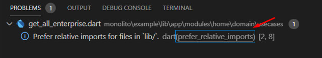

#  PADRÕES E BOAS PRÁTICAS - FLUTTER

# Introdução

O objetivo deste documento é definir e apresentar os padrões e melhores práticas do time de Flutter. O objetivo é que este documento seja usado como guia para o desenvolvimento de projetos, estabelecendo de forma comum a todo time as práticas, metodologias, arquiteturas, padrões, frameworks etc. que podem/devem ser usados.

Este ponto é importante, pois uma vez que estabelecido um "Potocolo" entre todo o time, pontos como controle de qualidade, alinhamento técnico do time, manutenibilidade, etc. são favorecidos, por isso é de extrema importância contar com a colaboração de todos para que o que aqui estabelecido seja seguido.

Outro aspecto importante, o conteúdo deste guia não será estático, ou seja, podendo ser alterado a medida que novas tecnologias e necessidades surgirem, por isso o time está sempre aberto a escutar propostas e melhorias que possam ser agregadas a este documento.

Para tal basta editar este documento e submeter um  _pull request_  com alteração ou abrir uma  _issue_ neste repositório.

# Versão flutter
A Versão do flutter que é utilizada neste projeto foi a 2.12.1

# Apresentação geral da arquitetura 
A arquitetura do projeto é dividia de forma modular subdividido em micro apps, onde tem o menor índice de acoplamento possível.

Cada modulo contem seu próprio ecossistema de arquitetura e a proposta adotada foi a do clean dart.
Veja a documentação sobre CLEAN [aqui](./CLEAN_ARCHITECTURE.md)

## Propostas estrutural
Seguindo o conceito de multirepo, ou seja, cada projeto ficara em um repositorio diferente, assim facilitando a manutenção por modulos separados.

 - [MULTIREPO](./MULTIREPO.md)

# Pull Requests
Veja a documentação sobre Pull Request [aqui](./PULL_REQUESTS.md)

# Git Flow
Veja a documentação sobre Git Flow [aqui](./GIT_FLOW.md)

# Testes
Veja a documentação sobre Testes [aqui](./TESTES.md)

## Recursos de terceiros

É importante que o time esteja alinhado sobre quais recursos de terceiros (libraries, frameworks, SDK's) podem ser utilizadas nos projetos do time de flutter, uma vez que essas dependências podem ter um impacto significativo no desenvolvimento e manutenção de um projeto (depreciação, bugs em aberto, incompatibilidades etc.). 

Antes de adicionar um recursos que não esteja na lista abaixo, observar os seguintes itens:

- Issues abertas Github
- Likes, Pub Points, Popularity
- Data ultima alteração
- Resolução de bugs encontrados
- Atualização para recursos mais novos do Flutter/Dart, ex. Null Safety

# Boas práticas de desenvolvimento
Para garantir que as boas práticas de desenvolvimento seguindo a [guia oficial do Dart](https://dart.dev/guides/language/effective-dart) utilizamos o package [Effective Dart](https://pub.dev/packages/effective_dart) 
Isso ira gerar Avisos de linhas que não  condiz com as boas praticas do Flutter e com um [link](https://dart-lang.github.io/linter/lints/prefer_relative_imports.html) para a documentação oficial do Dart explicando como corrigi-lo

# Dicas

Abaixo há alguns links de documentações e artigos que possam ser consultados

-  [Testes](https://medium.com/cristiano-cunha/testes-automatizados-dart-cf9df0e741ab)
-  [White Label Apps](https://itnext.io/white-label-apps-in-flutter-613b2d0a80ce)
-  [White Label in Flutter](https://medium.com/@ramiechaarani/how-to-make-a-white-label-app-in-flutter-6c3ea40fd7d5)
-  [Modular](https://medium.com/flutterando/quais-os-problemas-que-o-flutter-modular-veio-resolver-deaed96b71b3)