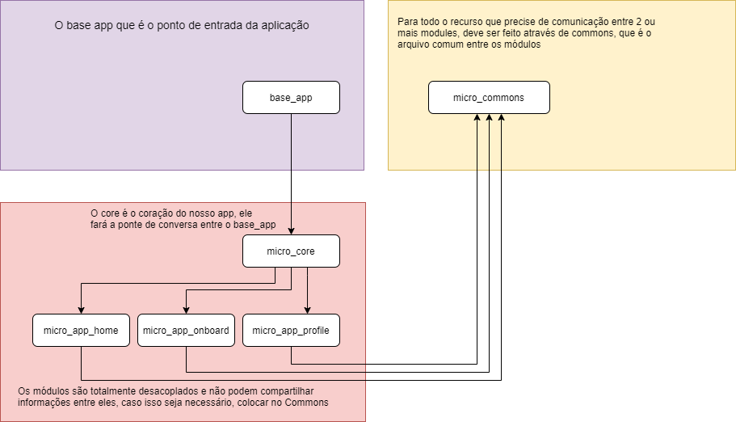

# Mobile Micro frontends

#### ESTRUTURA DE PROJETO

Na proposta da estrutura do projeto há uma quebra de funcionalidade (módulos) por package. E na imagem acima conseguimos também ver a dependência entre os projetos.
Vamos falar se cada um desses quadradinhos posteriormente.

#### Base App
O base app que é o ponto de entrada da aplicação, ele irá conversar somente com o CORE que acessará os módulos.
IMPORTANTE: Ele é o único projeto que irá ser criado com o template padrão do flutter (flutter create base_app). Os demais projetos necessitam ser criados com a flag –template=package (flutter create — template=package projeto)

No Base App podemos definir as validações antes de executar o app, onde podemos executar nossos scripts, validar versão do app e definir os flavors do projeto

#### Core

O core é o coração do nosso app, ele fará a ponte de conversa entre o base_app e os módulos é nele que estará a configuração das rotas principais e a chamada para o MaterialApp(), no `pubspec.yaml` você pode conferir todos os modulos utilizado

#### Commons

Para todo o recurso que precise de comunicação entre 2 ou mais modules, deve ser feito atraves de commons, que é o arquivo comum entre os mudulos, pois é o pacote responsável por ter tudo aquilo que será compartilhado entre todos os módulos, como interceptors, widgets, stores, etc.

#### Commons Dependencias

Como cada modulo será um package precisaremos inserir as dependências nos projetos lá no nosso pubspec na sessão “dependencies”, quando trabalhamos com monorepo simplesmente adicionamos o parâmetro “path” e colocamos a referência da pasta do projeto.

#### Module

Os módulos são totalmente desacoplados e nao podem compartilhar informações entre eles, caso isso seja necessário, colocar no Commons.

Para qualquer novo fluxo a ser desenvolvido é necessario criar um novo modulo, pois nele deve seguir sua implementação e recurssos de forma desacoplada e não impactar o projeto ao ser utilizado.  

### Recomendações
* Há um vídeo muito bacana do canal Código Fonte TV no Youtube falando sobre o Micro frontends [Aqui]('https://www.youtube.com/watch?v=BbNIuUy_F0w&t=535s')

* Existe uma series de vídeo no canal do Deivid Willians falando sobre o assunto [Aqui]('https://www.youtube.com/watch?v=5rjQ5ooWDoY&list=PLRpTFz5_57cufduUDgiZZqA_k5Q7UV_50')
